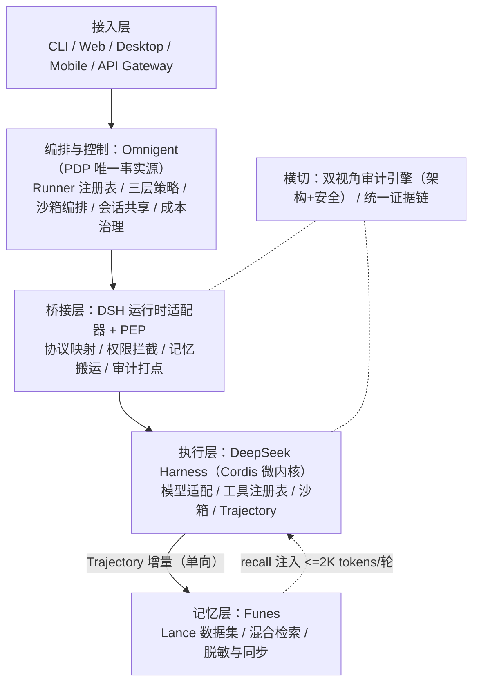

# Nexus

> **可插拔的统一 AI Agent 操作系统** —— DSH 执行 x Omnigent 治理 x Funes 记忆

[](https://github.com/OrvilleZhao/Nexus/actions/workflows/ci.yml)
[](https://github.com/OrvilleZhao/Nexus/actions/workflows/build-desktop.yml)
[](docs/DESIGN.md)
[](#许可证)
[](#测试覆盖)
[](https://github.com/deepseek-ai/deepseek-harness)
[](https://github.com/omnigent-ai/omnigent)
[](https://github.com/huggingface/funes)

**Nexus = 以 DeepSeek Harness 为执行核心、Omnigent 为治理层（PDP 唯一事实源）、Funes 为记忆层的企业级 Agent 集成发行版。**

---

## 当前状态

Phase 1 全部完成（9 Sprint），154 个测试全绿，6 个包可发布：

| 包 | 版本 | 测试 | 核心能力 |
|---|---|---|---|
| `@nexus/core` | 0.1.0 | 59 | 领域模型、SNE 事件、审计五元组、双视角审计引擎、缓存键 |
| `@nexus/bridge` | 0.1.0 | 41 | PEP 两级拦截、决策缓存、静态规则、PauseHandler 文件队列人审 |
| `@nexus/memory` | 0.0.1 | 28 | InjectionBudget 装入、TrajectorySync 去重、FunesClient CLI/MCP |
| `@nexus/adapter-dsh` | 0.0.1 | 8 | Cordis 插件骨架、PEP 拦截器、双工具注册 |
| `@nexus/adapter-omnigent` | 0.0.1 | 11 | Omnigent PDP HTTP 适配器、fail-closed、injectable fetch |
| `@nexus/sdk` | 0.0.1 | 7 | 一键集成层 `createNexusAdapter(config)` |

## 平台支持

| 平台 | 状态 |
|---|---|
| **macOS（Apple Silicon arm64）** | CI 矩阵含 `macos-latest`；Tauri dmg 自动构建 |
| Linux x64 / arm64 | CI 双平台验证 |
| Node.js | >=22（纯 TypeScript、零原生模块） |

---

## 为什么做 Nexus

2026 年的 coding agent 已经从"能跑 demo"走到"承担真实工作"，但四个结构性问题在规模化时集中爆发：

| 问题 | 现状 | Nexus 的回答 |
|---|---|---|
| **遗忘** | 每个会话结束即清零 | Funes 记忆层 + Trajectory 单向同步 |
| **失控** | 提示词级治理可被注入绕过 | Omnigent 基础设施级 PDP，模型不可覆盖 |
| **无据可查** | 缺少完整证据链 | 审计五元组 + 双视角审计引擎 |
| **锁定** | 押注单一 harness 风险大 | 桥接层防腐蚀：DSH 原生 + 其他协议适配 |

## 总体架构



## 核心设计决策（ADR）

| 编号 | 决策 | 状态 |
|---|---|---|
| **ADR-01** | 不新设统一控制平面，桥接层 = PEP，PDP 唯一决策源 | 定稿 |
| **ADR-02** | 双视角审计引擎（架构审计 + AI 安全审计） | 定稿 |
| **ADR-03** | DSH Cordis 原生插件优先，其他 harness 协议适配 | 定稿 |

## 仓库结构

```
nexus/
├── packages/
│   ├── core/                # @nexus/core         领域模型 / SNE / 审计引擎
│   ├── bridge/              # @nexus/bridge       PEP 拦截 / 决策缓存 / PauseHandler
│   ├── memory/              # @nexus/memory       FunesClient / TrajectorySync / 注入预算
│   ├── adapter-dsh/         # @nexus/adapter-dsh  Cordis 插件骨架
│   ├── adapter-omnigent/    # @nexus/adapter-omnigent  Omnigent PDP HTTP 适配器
│   ├── sdk/                 # @nexus/sdk          一键集成层
│   └── contracts/           # @nexus/contracts    MockPdp（private）
├── apps/
│   └── desktop/             # @nexus/desktop      Tauri v2 桌面壳（macOS dmg）
├── docs/
│   └── DESIGN.md            # 技术设计 v3.1
├── .github/workflows/
│   ├── ci.yml               # 双平台 CI（typecheck + lint + test + bench）
│   ├── release.yml          # tag v* 驱动 npm publish + GitHub Release
│   └── build-desktop.yml    # macOS ARM64 / x64 dmg 自动构建
└── AGENTS.md                # 工程约定速查
```

## 快速开始

### 安装

```bash
git clone git@github.com:OrvilleZhao/Nexus.git
cd Nexus
pnpm install                # 需 Node >=22
```

### 开发命令

```bash
pnpm typecheck              # 全 workspace TypeScript 类型检查
pnpm lint                   # ESLint（flat config）
pnpm test                   # Vitest 全量测试（154 tests）
pnpm test:coverage          # 覆盖率（lines >=90 / branches >=80）
pnpm build                  # 各包 tsc 编译到 dist/
pnpm bench                  # PEP 缓存命中 p99 <20ms 基准
```

### 作为库使用

```typescript
import { createNexusAdapter } from '@nexus/sdk';

const nexus = createNexusAdapter({
  pdp: { endpoint: 'http://localhost:8080' },
  funes: { exec: 'funes' },
  injectionBudgetTokens: 2000,
});

// 工具调用前拦截
const result = await nexus.intercept({ tool: 'bash', args: ['ls'] });

// 保存会话轮次
await nexus.saveTurn({ sessionId: 's1', messages: [...] });

// 跨会话检索
const recall = await nexus.recall({ query: '如何部署', topK: 5 });

// 审计摘要
const audit = await nexus.getAuditSummary({ sessionId: 's1' });
```

## Nexus Desktop

Tauri v2 桌面应用，仿 Codex 布局：

- 左侧：会话列表管理
- 中央：AI 对话区
- 底部：终端面板（Output / Audit 双 tab）
- 顶部：系统状态栏（Core / PEP / Memory / PDP 实时指示）

### CI 自动构建

每次 push 到 `main` 自动构建 macOS ARM64 + x64 dmg。推送 `v*` tag 时 dmg 自动挂载到 GitHub Release。

### 下载安装 dmg

1. 打开 [Actions → Build Desktop](https://github.com/OrvilleZhao/Nexus/actions/workflows/build-desktop.yml)
2. 点击最近一次成功的 workflow run
3. 在 **Artifacts** 区域下载对应架构的 zip：
   - `nexus-desktop-mac-arm64.zip` — Apple Silicon（M1/M2/M3/M4）
   - `nexus-desktop-mac-x64.zip` — Intel Mac
4. 解压得到 `.dmg` 文件，双击打开
5. 将 **Nexus Desktop** 拖入 **Applications** 文件夹
6. 首次打开：右键点击应用 → 选择 **打开**（未签名应用需手动信任）

### 本地构建 dmg

```bash
# 需要 macOS + Rust toolchain
cd apps/desktop
pnpm install
pnpm build:frontend         # 编译 TypeScript → JS
pnpm tauri build            # 输出到 src-tauri/target/release/bundle/dmg/
```

## 测试覆盖

| 包 | 测试数 | 覆盖率 |
|---|---|---|
| `@nexus/core` | 59 | 97.6% |
| `@nexus/bridge` | 41 | 95.1% |
| `@nexus/memory` | 28 | 97.5% |
| `@nexus/adapter-omnigent` | 11 | 97.6% |
| `@nexus/adapter-dsh` | 8 | 100% |
| `@nexus/sdk` | 7 | 100% |
| **合计** | **154** | **>95%** |

## 事实基线

- **DeepSeek Harness**：MIT，Cordis 微内核，"Everything is a Plugin"，developer preview（存在 breaking changes）
- **Omnigent**：Apache-2.0，Databricks 开源，meta-harness（Python），contextual policies + 云沙箱
- **Funes**：Apache-2.0，HF 发布，Rust 单二进制，Lance 数据集，MCP 模式

## 许可证

Apache-2.0（与 Omnigent/Funes 同为宽松协议，DSH MIT 兼容）。
