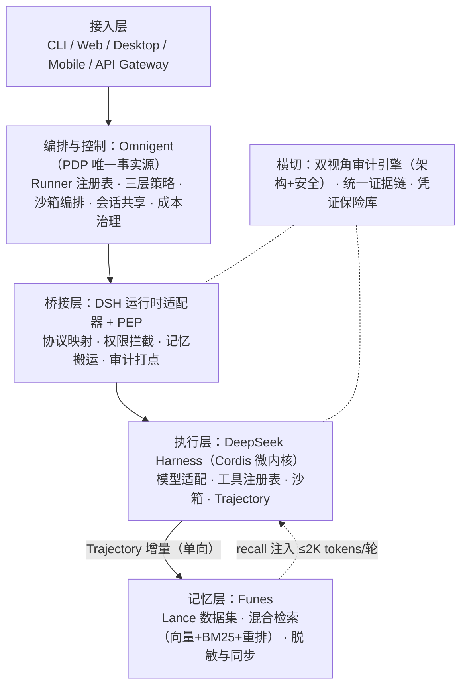

# Nexus

> **可插拔的统一 AI Agent 操作系统** —— DSH 执行 × Omnigent 治理 × Funes 记忆

[](https://github.com/OrvilleZhao/Nexus/actions/workflows/ci.yml)
[](docs/DESIGN.md)
[](#许可证)
[](https://github.com/deepseek-ai/deepseek-harness)
[](https://github.com/omnigent-ai/omnigent)
[](https://github.com/huggingface/funes)

**Nexus = 以 DeepSeek Harness 为执行核心、Omnigent 为治理层（PDP 唯一事实源）、Funes 为记忆层的企业级 Agent 集成发行版。**

当前状态：**设计已评审通过**（技术设计 v3.1，Q1–Q6 按建议立场采纳），Sprint 0（`@nexus/core`，TDD）已完成：43 个测试全绿、覆盖率 100%。后续 Sprint 按 [docs/DESIGN.md §10](docs/DESIGN.md) 测试先行清单推进。

## 平台支持

| 平台 | 状态 |
|---|---|
| **macOS 14+（Apple Silicon，原生 arm64）** | ✅ CI 矩阵含 `macos-latest`（arm64 runner），每 PR 双平台全量验证 |
| Linux x64 / arm64 | ✅ |
| Node.js | ≥22（纯 TypeScript、零原生模块，跨平台行为一致） |

发布流水线：`git tag v*` 触发 [Release](.github/workflows/release.yml)——双平台 verify → 构建 → npm 发布（未配置 `NPM_TOKEN` 时自动跳过）→ GitHub Release 附 `*.tgz` 离线制品。

---

## 为什么做 Nexus

2026 年的 coding agent 已经从"能跑 demo"走到"承担真实工作"，但四个结构性问题在规模化时集中爆发：

| 问题 | 现状 | Nexus 的回答 |
|---|---|---|
| **遗忘** | 每个会话结束即清零，跨会话/跨 harness/跨项目的决策与教训无法沉淀 | Funes 记忆层 + Trajectory 单向同步，跨 harness 统一记忆 |
| **失控** | 提示词级"治理"可被提示注入绕过；预算、权限、风险无从强制 | Omnigent 基础设施级策略（PDP），模型不可覆盖 |
| **无据可查** | Agent 做了什么、谁批准的、为什么——企业合规需要完整证据链 | 审计五元组（agent+session+tool_call+decision+token）+ 双视角审计引擎 |
| **锁定** | harness 生态爆发式增长（DSH 单月 212k stars），押注单一栈风险巨大 | 桥接层防腐蚀（ACL）：DSH 原生注入，其他 harness 协议适配 |

治理由基础设施层强制，而非系统提示词建议——这是 Nexus 安全叙事的根基。

## 总体架构



**关键边界**：Trajectory = 执行证据（会话内回放/分叉）；Funes = 知识资产（跨会话检索/共享）。单向同步，禁止双写、禁止在 Trajectory 之上再建检索层。

## 核心设计决策（ADR）

| 编号 | 决策 | 状态 |
|---|---|---|
| **ADR-01** | 不新设"统一控制平面"。桥接层 = Omnigent 的 DSH 运行时适配器 + 策略执行点（PEP）；策略只决策在 PDP，桥接层只做映射与拦截，避免双头策略 | ✅ 定稿 |
| **ADR-02** | 模块二由 IAST 调整为 AI 安全审计（SecDevOps 左移），与架构审计合并为双视角审计引擎 | ✅ 定稿 |
| **ADR-03** | 桥接层对 DSH 采用 Cordis 原生插件集成优先，对其他 Agent 走协议适配——双通道 | ✅ 定稿 |

## 技术路线

| 阶段 | 目标 | 关键交付 |
|---|---|---|
| **Phase 1** 价值验证 | dsh × funes 集成：跨会话「永不遗忘」 | `nexus.memory.recall/save` 插件；Trajectory→Funes 同步管线；PEP 骨架（静态规则 + 契约就绪）；2 周 demo |
| **Phase 2** 治理增强 | 接入 Omnigent，dsh 注册为 runner | PDP 质询全量接入；双视角审计引擎（PR 门禁→夜跑→按需）；策略执行零绕过 |
| **Phase 3** 生态标准化 | 记忆互操作 schema / 策略映射协议开源 | SNE 标准事件（MCP 对齐）；adapter SDK + 契约测试；社区接入；**Nexus Desktop（Tauri 壳 + Apple 公证 dmg，[DESIGN §5.2](docs/DESIGN.md)）** |

## 仓库布局（规划）

```
nexus/
├── docs/                  # 设计文档
│   └── DESIGN.md          # 技术设计 v3.1（实现版）
├── .github/workflows/     # ci.yml（双平台矩阵）· release.yml（tag 驱动发布）
├── packages/
│   ├── core/              # @nexus/core      领域模型 + SNE 事件 + 审计五元组 ✅ Sprint 0
│   ├── memory/            # @nexus/memory    FunesClient（CLI/MCP 双实现）· 同步管线 · 脱敏 · 注入预算
│   ├── bridge/            # @nexus/bridge    PEP：决策缓存 · fail-closed · PDP 客户端
│   ├── adapter-dsh/       # @nexus/adapter-dsh  Cordis 原生插件（recall/save · pre-execute · bridge-approval）
│   ├── audit/             # @nexus/audit     审计事件模型（Phase 2：双视角引擎）
│   └── contracts/         # @nexus/contracts 契约测试 fixtures（PDP / funes / dsh ctx 三方 mock）
├── AGENTS.md              # 工程约定速查（命令 / TDD / 依赖规则）
├── LICENSE                # Apache-2.0
└── pnpm-workspace.yaml
```

实现方法论：**TDD（红-绿-重构）**，每个 Sprint 的测试先行清单见 [docs/DESIGN.md §8](docs/DESIGN.md)。

## 快速开始

> Phase 1 交付后的预期形态：

```bash
# 安装 dsh 与 funes（均为官方二进制）
npx @deepseek/ai dsh plugin add @nexus/adapter-dsh   # 拟定
funes index                                           # 建立本地记忆索引
dsh web --profile nexus/workstation                   # 启动带记忆与策略的会话
```

### 开发者（从源码）

```bash
git clone git@github.com:OrvilleZhao/Nexus.git
cd Nexus
pnpm install          # 需 Node ≥22、pnpm（版本见 packageManager 字段）
pnpm test             # Vitest 全量
pnpm test:coverage    # 覆盖率门禁（lines ≥90 / branches ≥80）
pnpm bench            # tinybench 基准（PEP 缓存命中 p99 <20ms）
pnpm typecheck && pnpm lint && pnpm build
```

## 事实基线

三个上游组件均已经公开渠道二次核实（2026-09-08）：

- **DeepSeek Harness**（`deepseek-ai/deepseek-harness`）：MIT，2026-08-13 开源，Cordis 微内核，"Everything is a Plugin"，developer preview（**明示存在 breaking changes**）
- **Omnigent**（`omnigent-ai/omnigent`）：Apache-2.0，Databricks 2026-06 开源，meta-harness（Python 实现），contextual policies + 云沙箱 + 会话共享
- **Funes**（`huggingface/funes`）：**Apache-2.0**（许可证风险已解除），HF 2026-09-03 发布，Rust 单二进制，Lance 数据集，`.parquet` trace 导入契约 + MCP 模式

> 历史教训：AEGIS Squad、Myrmecia、AgentCorp 等引用未在公开渠道核实，已全部从设计依赖中移除，仅保留概念参考价值。

## 许可证

拟定 **Apache-2.0**（与 Omnigent/Funes 同为宽松协议，DSH 的 MIT 兼容）。待立项评审最终确认。

---

*Nexus · 技术设计 v3.0 · 2026-09-08 · 仅供内部立项与研发评审使用*
