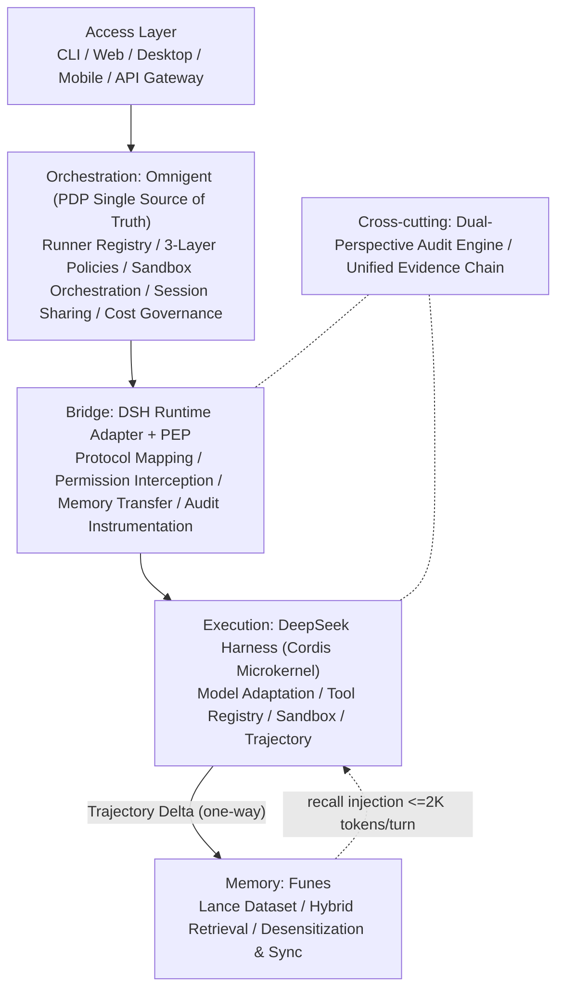

# Nexus

> **Pluggable Unified AI Agent Operating System** — DSH Execution x Omnigent Governance x Funes Memory

[](https://github.com/OrvilleZhao/Nexus/actions/workflows/ci.yml)
[](https://github.com/OrvilleZhao/Nexus/actions/workflows/build-desktop.yml)
[](docs/DESIGN.md)
[](#license)
[](#test-coverage)
[](https://github.com/deepseek-ai/deepseek-harness)
[](https://github.com/omnigent-ai/omnigent)
[](https://github.com/huggingface/funes)

**Nexus = Enterprise-grade Agent integration distribution with DeepSeek Harness as execution core, Omnigent as governance layer (PDP single source of truth), and Funes as memory layer.**

---

## Current Status

14 sprints completed, 163 tests passing, all phases done.

| Phase | Goal | Status |
|---|---|---|
| **Phase 1** Value Validation | dsh x funes integration, PEP skeleton | Done (Sprint 0-3) |
| **Phase 2** Governance Enhancement | Omnigent integration, audit workflow, policy feedback, workspace isolation | Done (Sprint 4-6, 10, 13-14) |
| **Phase 3** Ecosystem Standardization | SNE open source / SDK / memory interop / contract tests / Desktop dmg | Done (Sprint 7-9, 11-12) |

### Packages

| Package | Version | Tests | Capabilities |
|---|---|---|---|
| `@nexus/core` | 0.1.0 | 114 | Domain model, SNE events, audit quintuple, audit workflow (recon→architect→sast→judge→reporter), memory interop schema (JSON Schema), DSH/Funes/PDP contract tests, policy feedback engine, workspace isolation + fencing token |
| `@nexus/bridge` | 0.1.0 | 41 | PEP two-level interception, decision cache, static rules, PauseHandler file-queue human review |
| `@nexus/memory` | 0.0.1 | 28 | InjectionBudget loading, TrajectorySync dedup, FunesClient CLI/MCP |
| `@nexus/adapter-dsh` | 0.0.1 | 8 | Cordis plugin skeleton, PEP interceptor, dual tool registration |
| `@nexus/adapter-omnigent` | 0.0.1 | 11 | Omnigent PDP HTTP adapter, fail-closed, injectable fetch |
| `@nexus/sdk` | 0.0.1 | 7 | One-line integration `createNexusAdapter(config)` |

## Platform Support

| Platform | Status |
|---|---|
| **macOS (Apple Silicon arm64)** | CI matrix includes `macos-latest`; Tauri dmg auto-build |
| Linux x64 / arm64 | CI dual-platform verified |
| Node.js | >=22 (pure TypeScript, zero native modules) |

---

## Why Nexus

In 2026, coding agents have moved from demos to real work, but four structural problems explode at scale:

| Problem | Current State | Nexus Answer |
|---|---|---|
| **Amnesia** | Each session ends, cross-session knowledge lost | Funes memory layer + Trajectory one-way sync |
| **Ungovernable** | Prompt-level "governance" bypassed by injection | Omnigent infrastructure-level PDP, model cannot override |
| **No Audit Trail** | What agent did, who approved, why — missing | Audit quintuple + dual-perspective audit engine |
| **Lock-in** | Single harness risk | Bridge layer anti-corrosion: DSH native + protocol adapters |

Governance enforced at infrastructure level, not suggested by system prompts.

## Architecture



## Core Design Decisions (ADR)

| ID | Decision | Status |
|---|---|---|
| **ADR-01** | No new unified control plane. Bridge = PEP, PDP is sole decision source | Finalized |
| **ADR-02** | Dual-perspective audit engine (architectural + AI security audit) | Finalized |
| **ADR-03** | DSH Cordis native plugin first, other harness protocol adapters | Finalized |

## Repository Structure

```
nexus/
├── packages/
│   ├── core/                # @nexus/core         Domain model / SNE / Audit engine
│   ├── bridge/              # @nexus/bridge       PEP interception / Decision cache / PauseHandler
│   ├── memory/              # @nexus/memory       FunesClient / TrajectorySync / Injection budget
│   ├── adapter-dsh/         # @nexus/adapter-dsh  Cordis plugin skeleton
│   ├── adapter-omnigent/    # @nexus/adapter-omnigent  Omnigent PDP HTTP adapter
│   ├── sdk/                 # @nexus/sdk          One-line integration layer
│   └── contracts/           # @nexus/contracts    MockPdp (private)
├── apps/
│   └── desktop/             # @nexus/desktop      Tauri v2 desktop shell (macOS dmg)
├── scripts/
│   └── package-dmg.sh       # macOS DMG packaging script
├── docs/
│   └── DESIGN.md            # Technical design v3.1
├── .github/workflows/
│   ├── ci.yml               # Dual-platform CI (typecheck + lint + test + bench)
│   ├── release.yml          # Tag v* driven npm publish + GitHub Release
│   └── build-desktop.yml    # macOS ARM64 / x64 dmg auto-build
└── AGENTS.md                # Engineering conventions
```

## Quick Start

### Install

```bash
git clone git@github.com:OrvilleZhao/Nexus.git
cd Nexus
pnpm install                # Requires Node >=22
```

### Development Commands

```bash
pnpm typecheck              # Workspace-wide TypeScript type check
pnpm lint                   # ESLint (flat config)
pnpm test                   # Vitest full suite (154 tests)
pnpm test:coverage          # Coverage gate (lines >=90 / branches >=80)
pnpm build                  # Compile each package to dist/
pnpm bench                  # PEP cache hit p99 <20ms benchmark
```

### Use as Library

```typescript
import { createNexusAdapter } from '@nexus/sdk';

const nexus = createNexusAdapter({
  pdp: { endpoint: 'http://localhost:8080' },
  funes: { exec: 'funes' },
  injectionBudgetTokens: 2000,
});

// Intercept tool calls before execution
const result = await nexus.intercept({ tool: 'bash', args: ['ls'] });

// Save session turns
await nexus.saveTurn({ sessionId: 's1', messages: [...] });

// Cross-session recall
const recall = await nexus.recall({ query: 'how to deploy', topK: 5 });

// Audit summary
const audit = await nexus.getAuditSummary({ sessionId: 's1' });
```

## Nexus Desktop

Tauri v2 desktop app with Codex-style layout:

- Left: Session list management
- Center: AI conversation area
- Bottom: Terminal panel (Output / Audit dual tab)
- Top: System status bar (Core / PEP / Memory / PDP real-time indicators)

### Download & Install dmg

1. Go to [Actions -> Build Desktop](https://github.com/OrvilleZhao/Nexus/actions/workflows/build-desktop.yml)
2. Click the latest successful workflow run
3. In the **Artifacts** section, download the zip for your architecture:
   - `nexus-desktop-arm64-dmg.zip` — Apple Silicon (M1/M2/M3/M4)
   - `nexus-desktop-x64-dmg.zip` — Intel Mac
4. Unzip to get the `.dmg` file, double-click to open
5. Drag **Nexus Desktop** into **Applications**
6. First launch: right-click the app -> select **Open** (unsigned apps require manual trust)

### Build dmg Locally

```bash
# Requires macOS + Rust toolchain
cd apps/desktop
pnpm install
pnpm build:frontend         # Compile TypeScript -> JS
cd src-tauri
cargo build --release --target aarch64-apple-darwin
cd ..
BINARY_DIR=./src-tauri/target/aarch64-apple-darwin/release bash ../../scripts/package-dmg.sh 0.1.0 arm64
```

## Test Coverage

| Package | Tests | Coverage |
|---|---|---|
| `@nexus/core` | 114 | >95% |
| `@nexus/bridge` | 41 | 95.1% |
| `@nexus/memory` | 28 | 97.5% |
| `@nexus/adapter-omnigent` | 11 | 97.6% |
| `@nexus/adapter-dsh` | 8 | 100% |
| `@nexus/sdk` | 7 | 100% |
| **Total** | **163** | **>95%** |

## Upstream Baseline

- **DeepSeek Harness**: MIT, Cordis microkernel, "Everything is a Plugin", developer preview (breaking changes expected)
- **Omnigent**: Apache-2.0, Databricks open source, meta-harness (Python), contextual policies + cloud sandbox
- **Funes**: Apache-2.0, HF release, Rust single binary, Lance dataset, MCP mode

## License

Apache-2.0
