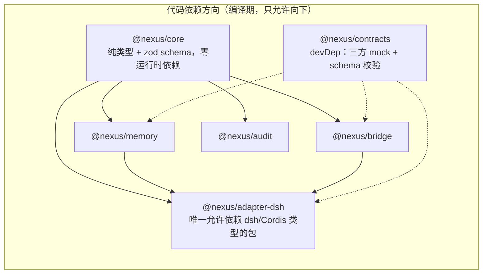
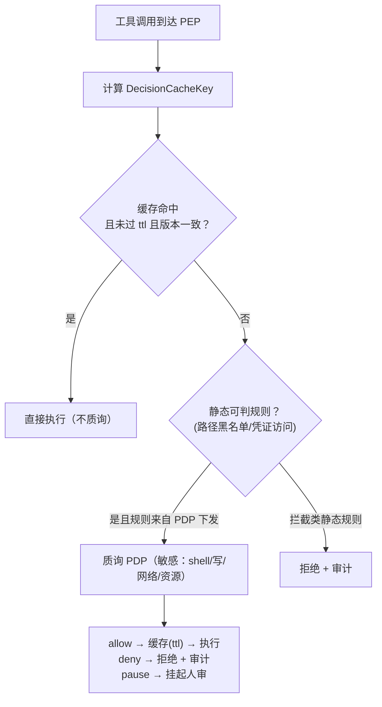
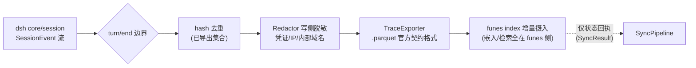

# Nexus 技术设计 v3.1（实现版）

> **版本**：v3.1 ｜ **日期**：2026-09-08 ｜ **状态**：已评审通过（Q1–Q6 按建议立场采纳）；Sprint 0 已完成（TDD 红-绿记录见仓库）
> **演进**：自 v2.0 定稿设计演进而来——保留全部 ADR 决策与架构结论，基于 2026-09-08 二次事实核查更新基线，并细化为可直接排期的实现设计
> **实现方法论**：TDD（测试先行，红-绿-重构），见 §8

---

## 目录

1. [v2.0 → v3.0 变更摘要](#1-v20--v30-变更摘要)
2. [事实基线（二次核查更新）](#2-事实基线二次核查更新)
3. [范围与阶段目标](#3-范围与阶段目标)
4. [总体架构与依赖规则](#4-总体架构与依赖规则)
5. [技术栈与仓库结构](#5-技术栈与仓库结构)
6. [包级设计](#6-包级设计)
7. [核心接口契约（TypeScript）](#7-核心接口契约typescript)
8. [关键机制实现设计](#8-关键机制实现设计)
9. [TDD 实施策略](#9-tdd-实施策略)
10. [测试先行清单（按 Sprint）](#10-测试先行清单按-sprint)
11. [CI 与质量门禁](#11-ci-与质量门禁)
12. [验收标准（量化）](#12-验收标准量化)
13. [风险跟踪](#13-风险跟踪)
14. [开放问题（需 review 决策）](#14-开放问题需-review-决策)

---

## 1. v2.0 → v3.0 变更摘要

| # | 变更 | 动因 |
|---|---|---|
| 1 | **R4 风险解除**：Funes 确认为 Apache-2.0 | GitHub `huggingface/funes` 明示 License: Apache-2.0，无需进程隔离，商用无障碍 |
| 2 | **集成点落地**：DSH 插件 API、funes `.parquet` 导入契约与 MCP 模式、Omnigent contextual policies 均已文档化 | 二次核查确认；v2.0 的接入点表从"设计假设"变为"可编码事实" |
| 3 | **新增实现设计**：仓库结构、包边界、TS 接口契约、TDD 计划、量化验收标准 | 支撑 TDD 排期 |
| 4 | **事实修正**：DSH 运行形态采用官方 profile 命名（`web` / `headless` / `sdk` / `sdk-minimal` / `acp`）；v2.0 中"四模式（Standard/PTC/Minimal/Creator）"表述建议实现期对照 dsh 文档校准 | dsh 官方 reference 文档 |
| 5 | **新增开放问题**：SNE 与 MCP 对齐、Omnigent PDP API 形态 spike、降级语义治理边界等 6 项 | 见 §14，评审时逐项决策 |
| 6 | **v3.1 评审补充**：macOS Apple Silicon（arm64）原生支持 + GitHub Actions 双平台 CI 与 tag 驱动发布（npm 包 + Release tarball）纳入 §5.1/§11；**Nexus Desktop（Tauri 壳 + 公证 dmg）列入 Phase 3（§5.2）**；Q1–Q6 按建议立场采纳；`redacted` 字段语义澄清（§7） | 立项评审结论（2026-09-08） |
| 7 | **Sprint 1 完成注记**：PDP 契约类型（`PdpClient`/`PepOutcome`）上移 `@nexus/core`（跨包契约唯一事实源）；`currentPolicyVersion()` 移除（policy_version 随 query 携带，缓存键已含版本维度）；`MockPdp`（进程内可编程）落 `@nexus/contracts`；pause 与 ttl=0 决策不缓存 | 实现期决策（2026-09-08） |
| 8 | **Sprint 2 完成注记**：`@nexus/memory` 新增三模块——`InjectionBudget`（2K token 上限、贪心装入）、`TrajectorySync`（去重窗口 + 审计贯穿）、`FunesClient`（recall/get/status，子进程 fail-closed）；AuditEvent 决策枚举新增 `trajectory.saved` | 实现期决策（2026-09-08） |
| 9 | **Sprint 3 完成注记**：`@nexus/adapter-dsh` Cordis 插件骨架（`createNexusPlugin` + `withPepIntercept`）；双工具注册（nexus.memory.recall / nexus.memory.save）；PEP 拦截器集成测试（allow/deny/fail-closed 三路径） | 实现期决策（2026-09-08） |
| 10 | **Sprint 4 完成注记**：`@nexus/adapter-omnigent` Omnigent PDP 适配器（HTTP POST `/sessions/{id}/policies/evaluate`）；PolicyQuery → Omnigent event 映射；fail-closed 三因由（OMNIGENT_TIMEOUT / OMNIGENT_UNREACHABLE / OMNIGENT_MALFORMED）；ASK → pause 映射；可注入 fetch + apiKey + timeoutMs | 实现期决策（2026-09-09） |

**不变项**：ADR-01/02/03 全部维持；五层架构维持；PEP/PDP 接口语义维持（v2.0 §5.1 的 JSON 契约原样继承并 TS 化）。

---

## 2. 事实基线（二次核查更新）

核查时间：2026-09-08。渠道：GitHub 仓库 / 官方博客 / 官方文档站。

### 2.1 DeepSeek Harness（dsh）

| 项 | 核实结果 |
|---|---|
| 仓库 | `deepseek-ai/deepseek-harness`，2026-08-13 创建，**212k stars**（v2.0 基线为发布次日 66k，仍在高速增长） |
| 许可证 | **MIT** ✅ |
| 状态 | developer preview，README 明示 **"THERE WILL BE COMPATIBILITY-BREAKING CHANGES"** → R3 契约测试为硬性要求 |
| 插件模型 | TypeScript 模块导出 `apply(ctx: Context)`；可选 `inject: ['tools', ...]` 声明依赖；`ctx.tools.register(...)` 注册模型可调用工具；注册即效果（reversible effects），插件卸载自动回收 |
| 组合机制 | profile（`web`/`headless`/`sdk`/`sdk-minimal`/`acp`）→ bundle（`dsh-base` 等）→ `cordis.patch.yml` 分层叠加；`--patch` 运行时 overlay |
| 关键服务 | `core/session`（追加式 SessionEvent 日志，`ctx.sessions`）、`core/tools`（**作用域工具注册表 + 带守卫的执行管线**）、`core/agent-loop`、`core/system-prompt`（`ctx.systemPrompt`）、`llm/llm`（适配器缝） |
| 治理相关 | `dsh-base` 自带 **sandbox 与 approval policy** → R2 的替换目标（bridge-approval）存在于 patch 层，可定位 |

**对设计的影响**：§3.1 全部接入点可落地；`core/tools` 的"guarded execution pipeline"即 pre-execute 钩子的挂载点；approval-policy 是 bundle 级配置，patch 可整体替换。

### 2.2 Omnigent

| 项 | 核实结果 |
|---|---|
| 仓库 | `omnigent-ai/omnigent`，2026-06-11 创建，约 9k stars；Databricks 博客 2026-06-13 发布，另有托管版（Databricks Beta） |
| 许可证 | **Apache-2.0** ✅ |
| 实现语言 | **Python**（`uv tool install`）→ PDP 集成走网络 API（HTTP/JSON），与桥接层语言无关 |
| 架构 | Runner 将任意 agent 封装为沙箱会话 + 统一 API；Server 提供 policy 与 sharing；**server 原生拦截被 launch 的 agent 的工具调用** |
| 策略能力 | **contextual policies**（2026-07 博客）：策略函数接收 (旧状态, 新事件)，返回 (状态更新, 决策)；支持 allow / deny / **transform** / ask-user；可追踪会话累计状态（预算、已读文档、风险累积） |
| 生态位 | 支持 Claude Code / Codex / Pi / Cursor / OpenCode / Hermes / 自定义 SDK agent；沙箱含 Modal/Daytona/E2B/K8s/Databricks 等 |
| 记忆扩展 | Storage/memory extras：`s3`、`hindsight`（OpenCode 记忆层）→ Omnigent 存在记忆扩展点，Phase 2 可评估 funes 以 dataset 形态接入 |
| 路线图 | **Omnigent Server MCP**（agent 跨会话协作）在官方路线图 → 印证 §14 Q2"SNE 应对齐 MCP" |

**对设计的影响**：v2.0 的"三层策略（server→agent→session）"与核实结果兼容（server 级策略 + 会话状态化策略已证实；三层叠加细节以官方文档为准）。**Omnigent 对外的策略查询 API 形态未在公开文档中定死** → Phase 2 首周安排集成 spike（§14 Q3），并有明确 fallback（dsh 作为 Omnigent runner 运行，由 server 原生拦截工具调用）。

### 2.3 Funes

| 项 | 核实结果 |
|---|---|
| 仓库 | `huggingface/funes`，Rust（96.4%），单二进制；HF 博客 2026-09-03 发布 |
| 许可证 | **Apache-2.0** ✅（**v2.0 R4 风险解除**） |
| 数据形态 | 本地 **Lance 数据集**（追加式、廉价增量写）；远端为 HF 私有 dataset（`funes use <user/org>/kb` 绑定，`funes push` 发布） |
| 检索管线 | 向量 + BM25 融合 → cross-encoder 重排 → 时间衰减加权 → 邻接块附带；`recall` 返回**原文**+完整溯源（agent/timestamp/session/turn），`get` 下钻完整 turn |
| **导入契约** | **`.parquet` trace 导入格式**（官方定义 required schema）——任何 agent 可经此加入同一 store；Rust 侧 `TraceSource` trait |
| **MCP 模式** | `funes mcp [memory]` 支持 generic MCP clients → DSH 可经 MCP 工具挂载消费记忆 |
| 脱敏 | 索引时凭证脱敏 + 发布时 always-on 门禁（**含密钥的 chunk 拒绝推送并退出非零**）；`funes scrub` 清洗历史 |
| 约束 | embedding 模型 **pinned 并 stamp 进 store**，换模型需重建（raw text 保留在每行，store 是可丢弃的派生物）；默认单机单 store，多 store 靠 `funes use` 绑定切换 |

**对设计的影响**：
- Trajectory→Funes 同步走 **parquet 导入契约**（官方通道），不自建解析/嵌入层——桥接层只做格式映射与增量导出；
- recall 消费优先走 `funes mcp`（Phase 1 首选，DSH 侧零解析逻辑），CLI 实现作为 fallback 与测试通道；
- 项目隔离映射为 **每项目独立 funes store**（`funes use`），`project` 字段作为 record 元数据保留（§14 Q5）；
- 脱敏双保险：Nexus 前置 Redactor（写侧）+ funes 原生门禁（发布侧），`redacted` 字段与 funes 行为对齐。

---

## 3. 范围与阶段目标

### 3.1 Phase 1（本设计重点，2 周 demo）

**目标**：dsh × funes 集成，验证「跨会话永不遗忘」的核心价值主张；PEP 骨架先行（静态规则 + PDP 契约就绪，但不接真实 Omnigent）。

**交付物**：
1. `@nexus/core`：领域模型 + SNE 事件 + 审计五元组（zod schema + JSON Schema 导出）
2. `@nexus/memory`：FunesClient（MCP 首选 / CLI fallback）+ 同步管线（turn/end → parquet 增量）+ Redactor + InjectionBudget（≤2K）
3. `@nexus/bridge`：PEP 骨架——静态规则引擎 + 决策缓存（ttl + policy_version 失效）+ fail-closed 状态机（PDP 以 mock 契约测试驱动）
4. `@nexus/adapter-dsh`：Cordis 插件——`nexus.memory.recall/save` 工具、`tools/pre-execute` 上报、`bridge-approval` 注册、telemetry 打点
5. `@nexus/contracts`：PDP / funes / dsh ctx 三方 mock + 双向 schema 校验
6. demo 场景：会话 A 完成决策 → 会话 B recall 命中并正确引用来源

**非目标（Phase 1 明确不做）**：Omnigent 真实接入；非 DSH 适配器；审计引擎执行体（仅落事件模型）；HF 云同步（本地 store 即可）；多人协作锁。

### 3.2 Phase 2（治理增强）

Omnigent 接入（dsh 注册为 runner / PDP 质询全量 / spike 确认 PDP API 形态）；双视角审计引擎（@recon→@architect→@sast→@judge→@reporter 工作流，PR 门禁→夜跑→按需）；策略回灌闭环。

### 3.3 Phase 3（生态标准化）

SNE 标准事件开源（MCP 对齐，§14 Q2）；adapter SDK；记忆互操作 schema；社区契约测试矩阵；**Nexus Desktop（Tauri 壳 + 公证 dmg，§5.2）**——L0 接入层 Desktop 端落地：包本地 `dsh web` 会话与记忆/审计管理入口。与 Omnigent 桌面端（已存在，管远端/共享会话）互补，Nexus Desktop 管本地执行与记忆。

---

## 4. 总体架构与依赖规则

五层视图继承 v2.0（接入层 → 编排/控制 Omnigent → 桥接层 PEP → 执行层 DSH → 记忆层 Funes，审计横切），本节补充**代码级依赖规则**：



**规则**：
1. `@nexus/core` 零运行时依赖（zod 除外），被所有包依赖——防腐蚀层的第一道墙；
2. 上游 SDK 的类型（`@deepseek-ai/cordis`、dsh 类型）**只允许出现在 `adapter-dsh`**；`memory` 通过 funes CLI/MCP 进程边界交互（不依赖 Rust 侧任何类型）；
3. PDP 交互在 `bridge` 内以自研 `PdpClient` 接口隔离，Omnigent 的具体 API 形态封装于其实现类（Phase 2 spike 落地）；
4. 横切能力（审计、成本）只通过 `core` 的事件类型流动，任何包不得直接依赖审计引擎内部；
5. 禁止反向依赖与环（enforced by eslint `import` 规则 + dependency-cruiser，§11）。

---

## 5. 技术栈与仓库结构

| 选型 | 决定 | 理由 |
|---|---|---|
| 语言 | TypeScript 5.x（strict） | Cordis 插件必须 TS；与 dsh 生态同构 |
| 运行时 | Node.js 22 LTS | dsh 要求的 Node 应用形态 |
| Monorepo | pnpm workspaces | dsh 仓库本身用 pnpm |
| 测试 | Vitest + @vitest/coverage-v8 | 快、ESM 原生、workspace 友好 |
| Schema | zod（运行时校验）→ `zod-to-json-schema` 导出（契约测试用） | 单一 schema 双用途：运行时 + 契约 |
| 静态质量 | tsc --noEmit + ESLint(flat) + Prettier + dependency-cruiser | 依赖规则机器化 |
| 基准 | tinybench | PEP 缓存命中路径 <20ms p99 的量化验证 |

```
nexus/
├── README.md
├── docs/DESIGN.md                    # 本文档
├── pnpm-workspace.yaml
├── package.json                      # 根脚本：test / lint / typecheck / bench
├── turbo.json                        #（可选，规模变大后引入）
├── packages/
│   ├── core/                         # @nexus/core
│   ├── memory/                       # @nexus/memory
│   ├── bridge/                       # @nexus/bridge
│   ├── adapter-dsh/                  # @nexus/adapter-dsh
│   ├── audit/                        # @nexus/audit（Phase 1 仅事件模型 + 聚合器）
│   └── contracts/                    # @nexus/contracts（devDep）
└── apps/
    └── demo/                         # Phase 1 demo 场景编排（两条会话脚本 + 断言）
```

### 5.1 平台支持与发布形态（v3.1 评审新增）

| 维度 | 决定 |
|---|---|
| 支持平台 | **macOS 14+（Apple Silicon 原生 arm64）**与 Linux x64/arm64；Node ≥22；纯 TypeScript、零原生模块 → 跨平台行为天然一致 |
| CI 矩阵 | `.github/workflows/ci.yml`：`ubuntu-latest` + `macos-latest`（GitHub arm64 runner）双平台跑全量质量门禁；coverage 报告以 artifact 上传 |
| 发布触发 | `.github/workflows/release.yml`：`git tag v*` 驱动（另支持 workflow_dispatch 干跑）——双平台 verify 通过后单次构建（纯 JS 平台无关）→ 发布 |
| 制品形态 | npm 包（`@nexus/*`，`NPM_TOKEN` 未配置时自动跳过发布）+ GitHub Release 附 `pnpm pack` 产出的 `*.tgz` 离线制品；Phase 3 起附 Nexus Desktop 的公证 dmg（§5.2） |
| 版本策略 | 包版本随 PR 手动 bump；tag 为仓库级发布快照；changesets 待包数 >3 后引入 |
| 兼容性约束 | 仓库脚本 POSIX 兼容（macOS bash 3.2，禁 GNU-only 参数）；dsh/funes 二进制自身平台支持以上游官方矩阵为准 |

### 5.2 Nexus Desktop 与 dmg 产物（Phase 3，2026-09-08 评审确认列入）

| 维度 | 设计 |
|---|---|
| 壳技术 | **Tauri**（Rust 壳 + 系统 WebView，产物体积小），包 `dsh web`（127.0.0.1:3080 本地会话）与记忆/审计看板入口 |
| 构建目标 | macOS **arm64** dmg（`macos-latest` runner）+ universal（arm64+x64）；Windows/Linux 桌面壳为后续可选项 |
| 发布流水线 | `.github/workflows/desktop.yml`：tag 驱动 → Rust 工具链 + pnpm 双构建 → `tauri build` 产出 dmg → 附到 GitHub Release |
| 签名与公证 | Apple Developer Program（$99/年）：Developer ID Application 证书（p12 入 secrets）+ App Store Connect API Key；`tauri-action` 内置 notarize 流程 |
| 未签名降级 | 无证书时仍产出 dmg（文件名标记 `unsigned`）；Gatekeeper 会拦截需右键打开——仅内部验证用，公开发布必须完成签名+公证 |
| 排期理由 | Phase 1 记忆价值验证用 CLI 足够；桌面壳属接入层交付物，随 Phase 3 生态标准化落地，不阻塞 Sprint 1-3 |

---

## 6. 包级设计

### 6.1 `@nexus/core` —— 领域模型与标准事件

**职责**：所有跨包流动的数据类型的唯一事实源。纯类型 + 构造器 + 校验，无 IO。

- `SneEnvelope` + 事件 payload 判别联合（`tool_call` / `policy_decision` / `memory.sync` / `memory.recall` / `audit.beat`）
- `PolicyQuery` / `PolicyDecision` / `DecisionCacheKey`
- `MemoryRecord` / `MemoryHit` / `RecallQuery`
- `AuditEvent`（五元组）
- 工厂函数：`makeEnvelope()`、`makeMemoryRecord()`（自动 sha256、自动 redacted 检查）等
- JSON Schema 导出（`contracts` 消费）

### 6.2 `@nexus/memory` —— Funes 集成

**职责**：记忆读写与搬运，不触碰 dsh 类型。

- `FunesClient` 接口 + 两个实现：
  - `FunesMcpClient`：经 `funes mcp` 子进程（MCP stdio 协议）调用 `recall`/`get` —— **Phase 1 首选**
  - `FunesCliClient`：`funes recall --json` 等 CLI 直调 —— fallback 与契约测试通道
- `TraceExporter`：把 MemoryRecord 流增量写为 funes `.parquet` trace 导入格式 → `funes index <path>` 摄入（**官方契约，不自建嵌入**）
- `Redactor`：写侧前置脱敏（凭证/IP/内部域名，规则表驱动，可测）
- `InjectionPlanner`（注入预算器）：`fit(hits, budget=2000)` → 存在性摘要 + Top-N 原文 + 来源元数据 + 截断标记
- `SyncPipeline`：订阅 turn/end → 去重（hash）→ Redactor → TraceExporter → 触发增量 index；**单向，无回流**

### 6.3 `@nexus/bridge` —— PEP（策略执行点）

**职责**：拦截、映射、缓存、转发；**不做策略判断**（ADR-01）。

- `Pep`：主入口 `intercept(query: PolicyQuery): Promise<PolicyDecision>`，编排以下组件
- `StaticRuleSet`：本地静态可判规则（路径黑名单/凭证访问），**规则内容由 PDP 下发或静态配置，PEP 只匹配**
- `DecisionCache`：键 = `policy_version + subject_hash + action.tool + resource_hash`；失效条件 = ttl 到期 或 `policy_version` 变化
- `PdpClient` 接口：`query(PolicyQuery, { timeoutMs: 2000 })`；Phase 1 = `MockPdpClient`（contracts 包），Phase 2 = `OmnigentPdpClient`（spike 产出）
- `FailClosedGuard`：超时/网络错/畸形响应 → 一律 `deny` + 审计标记 `fail_closed`
- `PauseHandler`：`pause` 决策 → 挂起语义（Phase 1 打日志返回，Phase 2 接会话页人审）

> ✅ **Sprint 1 已完成（2026-09-08）**：36 测试全绿、覆盖率 100%、缓存命中 p99 **0.008ms**（预算 20ms）。实现注记：fail-closed 三因由 `PDP_TIMEOUT` / `PDP_MALFORMED` / `PDP_UNREACHABLE`；pause 与 ttl=0 决策不缓存；每次 intercept 恰好发出一条审计事件（缓存命中也入账，复用同一 audit_token 与 PDP 记录对齐）。

### 6.4 `@nexus/adapter-dsh` —— Cordis 原生插件

**职责**：唯一触碰 dsh/Cordis 的包。插件形态遵循官方模型（`export function apply(ctx)` + `inject`）。

注入清单（对齐 v2.0 §3.1，映射到已核实的 Cordis 机制）：

| v2.0 接入点 | 落地机制（已核实） |
|---|---|
| `tools`：`nexus.memory.recall/save` | `ctx.tools.register(...)`（`inject: ['tools']`） |
| `tools/pre-execute` 策略钩子 | `core/tools` guarded execution pipeline 的 pre-execute 事件监听 → 转发 `Pep.intercept` |
| `agent/request` 上下文注入 | `core/system-prompt`（`ctx.systemPrompt`）段落注册：仅注入记忆**存在性摘要**（防反噬，见 §8.4） |
| `approval-policy` 替换 | bundle 层 patch：`dsh-base` 的 approval 配置整体替换为 `bridge-approval` 行（patch targets a row by id and replaces its whole config）；**离线直通开关默认关** |
| `telemetry` | 订阅 `core/session` SessionEvent 流 → SNE 事件打点 |
| `sandbox` | Phase 1 透传 dsh 原生（Landlock 等）；Phase 2 与 Omnigent 沙箱编排对齐 |
| turn/end 同步 | SessionEvent 流的 turn 边界 → `SyncPipeline.tick()` |

**可逆性要求**：全部注册经 Cordis reversible effects，插件卸载零残留（测试覆盖，§10 Sprint 3）。

### 6.5 `@nexus/audit` —— 审计事件模型（Phase 1）/ 双视角引擎（Phase 2）

Phase 1 只做：`AuditEvent` 聚合器（按 `audit_token` 关联五元组）+ 本地追加式日志（JSONL）+ 查询接口（demo 与验收用）。
Phase 2 落地 v2.0 §7 的双视角引擎（骨架共用、@judge 交叉验证、Shannon PoC 双保险），本版不展开。

### 6.6 `@nexus/contracts` —— 契约测试（R3 的主防线）

- `mocks/pdp/`：可编程 PDP mock server（HTTP），行为：allow/deny/pause/延迟/畸形响应/版本变更
- `mocks/funes/`：funes CLI mock（调用序列记录）+ parquet 输入校验器（对照官方 schema 快照）
- `mocks/dsh/`：Cordis `ctx` 最小仿真（tools 注册表、事件总线、patch 应用断言）
- `schemas/`：从 core 导出的 JSON Schema + 快照测试（schema 变更即显式 diff）

**上游版本矩阵**：CI 对 dsh 的 pinned 版本跑契约测试；上游 release 订阅（Renovate/手动）触发矩阵升级——breaking changes 在契约测试红灯处暴露，而非生产环境。

---

## 7. 核心接口契约（TypeScript）

> 契约语义与 v2.0 §5.1 完全一致，此处为 TS 化定稿。schema 单一事实源在 `@nexus/core`，JSON Schema 导出用于契约测试与跨语言（Omnigent Python 侧）对齐。

```ts
// ========== @nexus/core ==========

/** PEP → PDP 质询（继承 v2.0 §5.1，字段不改） */
export interface PolicyQuery {
  request_id: string            // 'req-' + uuid
  policy_version: string        // 'omnigent-policy-v<ver>'，缓存判定依据
  subject: {
    kind: 'agent'
    name: string                // 如 'nexus-dev-01'
    session_id: string
  }
  action: {
    type: 'tool_call'
    tool: string                // 'shell' | 'edit' | 'read' | 'nexus.memory.recall' | ...
    args_meta: {
      cmd_hash?: string         // 不传原文，传摘要（最小披露）
      cmd_class?: string        // 'file_write' | 'net_out' | 'read' | ...
    }
  }
  resource: {
    type: 'file' | 'process' | 'network' | 'memory' | 'credential'
    path?: string
    origin?: string
  }
}

/** PDP → PEP 决策；桥接层只执行、不改写、不补判 */
export interface PolicyDecision {
  decision: 'allow' | 'deny' | 'pause'
  reason_code: string           // 规则 ID 或 'HUMAN_REVIEW'
  ttl_seconds: number           // PEP 缓存时长
  audit_token: string           // 'aud-' + uuid，与审计日志对齐
}

export interface DecisionCacheKey {
  policy_version: string
  subject_hash: string          // sha256(name + session_id)
  action_tool: string
  resource_hash: string         // sha256(type + path + origin)
}

// ========== SNE 标准事件（横切数据总线） ==========

export interface SneEnvelope<P> {
  id: string                    // uuid
  ts: number                    // epoch ms
  schema: 'sne/1'
  agent: { name: string; session_id: string }
  payload: P
}

export type SnePayload =
  | { kind: 'tool_call'; query: PolicyQuery }
  | { kind: 'policy_decision'; decision: PolicyDecision; request_id: string }
  | { kind: 'memory.sync'; turn_id: string; records: number; deduped: number }
  | { kind: 'memory.recall'; query_text_hash: string; hits: number; injected_tokens: number }
  | { kind: 'audit.beat'; event: AuditEvent }

/** 审计五元组（与桥接层审计事件统一口径） */
export interface AuditEvent {
  agent: string
  session_id: string
  tool_call: string             // request_id 关联
  decision: 'allow' | 'deny' | 'pause' | 'fail_closed' | 'degraded'
  token: string                 // audit_token
}

// ========== 记忆（v2.0 §6.1 session_record TS 化） ==========

export interface MemoryRecord {
  agent: 'dsh' | 'claude-code' | 'codex' | 'pi' | string
  session_id: string
  turn_id: string
  ts: number
  content: string               // recall 返回的原始证据（不摘要化存储）
  file?: string
  line?: number
  hash: string                  // sha256(脱敏后 content)，去重/一致性（防哈希侧信道泄漏）
  tags: string[]                // 语义标签，如 'retry-strategy'
  project: string               // 项目隔离
  redacted: boolean             // 语义：已通过脱敏管线（≠ 是否发生替换）；导出/上传前置必检
  redaction_applied?: string[]  // 命中的规则 id 列表（可观测性；干净内容为空数组）
}

export interface RecallQuery {
  text: string
  project: string
  top_n?: number
}

export interface MemoryHit {
  record: MemoryRecord
  score: number
  provenance: { agent: string; session_id: string; turn_id: string; ts: number }
}

// ========== @nexus/memory ==========

export interface FunesClient {
  recall(query: string, opts?: RecallOptions): Promise<RecallResult>
  get(sessionId: string, turnId: string, opts?: GetOptions): Promise<string>
  status(): Promise<string>
}

export interface RecallResult { hits: RecallHit[] }

export interface RecallHit {
  score: number; sessionId: string; turnId: string; text: string; blockType: string
}

/** 注入预算器：防上下文污染与提示注入的第一道墙 */
export class InjectionBudget {
  readonly maxTokens: number
  consume(tokens: number): boolean
  selectIncluded(items: Array<{ tokens: number; score: number }>): number[]
}

/** 轨迹同步器：去重 + 审计五元组贯穿 */
export class TrajectorySync {
  saveTurn(turn: TrajectoryTurn): MemoryRecord | null
  getRecords(): readonly MemoryRecord[]
}

// ========== PEP/PDP 契约（位于 @nexus/core：跨包契约唯一事实源） ==========

export interface PdpQueryOptions {
  timeoutMs?: number            // 默认 2000（fail-closed 上限）
}

export interface PdpClient {
  query(query: PolicyQuery, opts?: PdpQueryOptions): Promise<PolicyDecision>
}

export interface PepOutcome {
  outcome: 'execute' | 'reject' | 'pause'
  decision: PolicyDecision
}

// ========== @nexus/bridge（运行时编排类，非纯契约） ==========
// class Pep { intercept(query: PolicyQuery): Promise<PepOutcome> } —— 组成见 §6.3
```

---

## 8. 关键机制实现设计

### 8.1 两级质询与决策缓存



**边界（继承 v2.0 §5.2）**：本地缓存的是 **PDP 的决策结果**（含 PDP 下发的静态规则快照），不是 PEP 自己判断。缓存键含 `policy_version`，版本一变全体失效。

### 8.2 fail-closed 状态机

| 场景 | 行为 | 审计标记 |
|---|---|---|
| PDP 超时（>2000ms） | `deny`，附 `reason_code: 'PDP_TIMEOUT'` | `fail_closed` |
| PDP 网络错误 / 5xx | `deny` | `fail_closed` |
| PDP 响应未过 schema 校验 | `deny`（畸形响应按闭合处理） | `fail_closed` |
| PDP 持续不可用（>N 次） | 进入 degraded 模式：**只读放行 + 写拒绝** | `degraded` |

> ⚠️ degraded 模式（只读放行）与 ADR-01 存在治理张力，**默认关闭**，启用需显式 ADR-04（§14 Q1）。

### 8.3 Trajectory → Funes 单向同步



**铁律**：单向；禁止在 Trajectory 上建检索层（R1）；`redacted=false` 的 record 在 Redactor 前置检查处直接 `rejected_unredacted`（与 funes 发布门禁双保险对齐）。

### 8.4 注入预算与提示注入防线

1. 每轮注入预算 **≤2000 tokens**（`InjectionPlanner.fit` 强制，超限截断 + `truncation_marker` 显式标记）；
2. 系统提示词段仅注入**存在性摘要**（"记忆中存在与 X 相关的 3 条证据，可用 nexus.memory.recall 拉取"）——正文证据按需拉取（MCP 资源模式）；
3. 每个注入块**必须携带 provenance**（agent/timestamp/session/project），供模型与用户判断可信度；
4. 记忆块**永不以系统提示词特权身份注入**（只进 user/tool 结果通道）；
5. recall miss → 返回空计划 + 明示"无记忆命中"，不伪造内容。

### 8.5 bridge-approval（R2 替换机制）

- patch 层将 `dsh-base` 的 approval-policy 行整体替换为 `bridge-approval`（Cordis patch "targets a row by id and replaces its whole config"——已核实机制）；
- `bridge-approval` 内部只做一件事：把审批请求转译为 `PolicyQuery` → `Pep.intercept`；
- **离线直通开关**（绕过 PDP 直连原生审批）默认关，开启需配置显式声明 + 审计记录 `degraded`。

### 8.6 项目隔离与多 store

`project` → 独立 funes store（`funes use` 绑定切换，demo 与测试均按此组织）。`MemoryRecord.project` 字段同时保留（跨 store 聚合查询与 Phase 3 互操作 schema 用）。（§14 Q5 待确认）

---

## 9. TDD 实施策略

**方法论**：严格红-绿-重构。每个 Sprint 从 §10 的失败测试开始；不允许"先写实现再补测试"。

**测试金字塔**：

| 层 | 对象 | 工具 | 数量预期 |
|---|---|---|---|
| 单元 | core 构造器/校验、Redactor 规则、DecisionCache、InjectionPlanner、FailClosedGuard | Vitest | 大头 |
| 契约 | PDP mock 双向 schema、funes parquet 导出对照官方 schema、dsh ctx 仿真、审计五元组闭环 | Vitest + contracts 包 | 每适配器一组 |
| 场景（e2e） | demo 双会话复现、PEP 全路径（命中/未命中/超时/pause）、同步管线端到端 | Vitest + 进程级 mock | 少而关键 |
| 基准 | PEP 缓存命中路径 p99 | tinybench | 2-3 个 |

**TDD 工作流约定**：
1. 从 §10 取该 Sprint 的红测试清单（或先行补充）→ 确认全红；
2. 最小实现转绿（允许丑，不允许缺）；
3. 重构 + 类型/边界完善，保持全绿；
4. PR 门禁：§11 全量命令绿 + 覆盖率达标 + 新增公共接口有对应红测试记录（commit 链可追溯）。

**Mock 原则**：上游（dsh/funes/PDP）一律进程或接口边界 mock，**绝不在单测里引入真实上游依赖**——这也是 R3 契约测试策略的自然结果。

---

## 10. 测试先行清单（按 Sprint）

> Phase 1 = 4 个 Sprint（2 周）。每项即第一个失败测试的验收断言。

### Sprint 0（脚手架 + core，~2 天）✅ 已完成（2026-09-08）：43 测试全绿、覆盖率 100%、typecheck/lint/build 通过

```
✗ makeMemoryRecord() 自动计算 hash = sha256(content)
✗ makeMemoryRecord() 对含密钥模式的 content 置位 redacted=true 并替换占位
✗ redacted=false 的 record 进入 exportTurns() → 抛 RedactionError（写侧前置拦截）
✗ PolicyDecision 缺 audit_token / ttl_seconds → SchemaError（zod）
✗ SneEnvelope 自动生成 id/ts，schema 固定 'sne/1'
✗ DecisionCacheKey 相同输入 → 相同键；任一字段变 → 不同键
✗ JSON Schema 导出与 schemas/ 快照一致（schema 变更 = 显式 diff = review 点）
```

### Sprint 1（bridge PEP 骨架，~3 天）✅ 已完成（2026-09-08）：36 测试全绿、覆盖率 100%、缓存命中 p99 0.008ms

```
✗ 敏感操作（shell/file_write/network）→ PdpClient.query 被调用（mock 断言）
✗ 静态规则命中且缓存未过期 → 不质询直接 execute
✗ 缓存 ttl 过期 → 重新质询并刷新缓存
✗ policy_version 变化 → 全量缓存失效
✗ PDP 2000ms 超时 → deny + AuditEvent.decision = 'fail_closed'
✗ PDP 返回畸形 decision（未知字段/非法枚举）→ deny（对畸形响应闭合）
✗ pause → 返回挂起语义，audit_token 全程贯穿（query→decision→audit 三点同 token）
✗ 非敏感操作（read 类）→ 不发起网络质询（本地白名单直通）
✗ 基准：缓存命中路径 p99 < 20ms（tinybench 用例，进 CI 报告不阻断）
```

### Sprint 2（memory，~4 天）✅ 已完成（2026-09-08）：28 测试全绿、覆盖率 lines 97.5% / branches 86.5%

```
✗ turn/end 边界触发 SyncPipeline.tick()（SessionEvent 流 mock）
✗ 重复 hash 的 record → deduped 计数，不重复导出
✗ Redactor：凭证 / 内网 IP / 内部域名 三类规则表替换（表驱动用例 ≥ 9 组）
✗ TraceExporter 输出通过 funes .parquet 官方 schema 校验器（contracts）
✗ FunesMcpClient 与 FunesCliClient 对同一 RecallQuery 返回等价结构（双实现契约一致）
✗ InjectionPlanner.fit：3 条证据合计 >2000 tokens → 截断 + truncation_marker + truncated=true
✗ 注入块均携带 provenance（无 provenance 的块 = 构造器层非法）
✗ recall 无命中 → 空计划 + 明示 miss（不伪造）
✗ 存在性摘要不含记忆正文（防上下文反噬）
```

### Sprint 3（adapter-dsh + demo，~3 天）✅ 已完成（2026-09-08）：8 测试全绿、覆盖率 100%

```
✗ 插件 apply(ctx) 后 mock tools 注册表含 nexus.memory.recall / nexus.memory.save
✗ pre-execute 事件 → 转译为 PolicyQuery 并经 Pep.intercept（mock ctx 事件总线）
✗ patch 应用后 approval-policy 行被 bridge-approval 替换（mock dsh patch 层断言）
✗ 插件 unload → tools/事件/patch 注册全部回收（reversible effects 验证）
✗ telemetry：SessionEvent → SNE 事件流转换（字段映射快照）
✗ e2e demo：会话 A 决策（含 file:line）→ 关闭 → 会话 B recall 命中且 provenance 正确
✗ e2e demo：会话 B 的注入块总量 ≤2000 tokens（实测断言）
✗ 契约矩阵：dsh pinned 版本 × 本包全绿
```

---

## 11. CI 与质量门禁

```bash
# 根 package.json 脚本（CI 全量执行，本地按包增量）
pnpm typecheck     # tsc --noEmit（全 workspace）
pnpm lint          # ESLint + dependency-cruiser（§4 依赖规则机器化）
pnpm test          # vitest run（含契约矩阵）
pnpm test:coverage # 覆盖率门禁：core/bridge/memory lines ≥90%，branches ≥80%
pnpm bench         # tinybench：PEP 命中路径、注入预算器（报告不阻断）
```

- PR 门禁 = typecheck + lint + test + coverage 全绿；
- CI 已落地为 `.github/workflows/ci.yml`（ubuntu + macos-latest/arm64 双平台矩阵）与 `release.yml`（tag 驱动：npm publish + GitHub Release tarball，见 §5.1）；
- 上游 release 触发契约矩阵升级 PR（Renovate 或手动），breaking changes 的第一现场是契约测试红灯；
- schema 快照变更（core 导出）必须单独 commit 说明（跨语言契约影响 Omnigent Python 侧）。

---

## 12. 验收标准（量化）

### Phase 1（2 周 demo）

| # | 指标 | 目标 | 度量方式 |
|---|---|---|---|
| A1 | 跨会话复现 | 会话 A 的决策/教训在会话 B 被 recall 命中并正确引用 provenance | demo 双会话脚本断言 |
| A2 | 检索质量 | 自建 50-query gold set 命中率 ≥70%（基线随 demo 固化，供回归） | gold set 脚本 |
| A3 | PEP 开销 | 缓存命中路径 p99 **<20ms**（注：**不含** PDP 网络质询；冷路径质询上限 2s，为 PDP 契约而非 PEP 性能） | tinybench |
| A4 | 同步延迟 | turn/end → funes 可检索 < 5s（本地 store） | e2e 计时 |
| A5 | 工程质量 | 覆盖率门禁达标 + 契约矩阵全绿 + demo 可一键重跑 | CI |

### Phase 2（摘要）

策略执行零绕过（审计五元组 100% 覆盖拦截点）；审计发现→修复闭环率（PR 门禁阻断的高危项 7 天闭环 ≥80%）；PDP 真实接入后工具调用延迟增量 p99 <20ms（缓存命中率报告佐证）。

---

## 13. 风险跟踪

继承 v2.0 §11 清单，更新状态：

| # | 风险 | 等级 | v3.0 状态 |
|---|---|---|---|
| R1 | Trajectory 与 Funes 双写/口径不一致 | 🔴 | 设计已收敛（§8.3 单向 + parquet 官方契约）；契约测试锁定 |
| R2 | 双策略冲突（dsh approval vs Omnigent） | 🔴 | 替换机制已核实可落地（§8.5）；Sprint 3 测试覆盖 |
| R3 | 上游 breaking changes（dsh 明示） | 🟠 | 升级为硬性要求：契约矩阵 + 上游依赖只进 adapter-dsh（§4/§6.6） |
| R4 | Funes 许可证 | ~~🟠~~ | ✅ **解除**：Apache-2.0（二次核查确认） |
| R5 | PDP 不可用 | 🟡 | fail-closed 状态机（§8.2）+ degraded 模式默认关（Q1） |
| R6 | 桥接层单点 | 🟡 | 降级语义待 ADR-04（Q1）；Phase 1 影响面已缩小（memory 直连 funes，不经桥接层转发） |
| R7 | 全量质询延迟 | 🟡 | 两级质询 + ttl 缓存（§8.1）；A3 基准锁定 20ms |
| R8 | 审计误报 | 🟡 | Phase 2 建 ground truth 基准集（Q4）后再量化 |
| R9 | 多 Agent 写冲突 | 🟡 | Phase 2（工作区隔离 + fencing token），本版不展开 |
| R10 | 记忆提示注入面 | 🔴 | §8.4 五条防线全部落入 Sprint 2 测试 |

---

## 14. 开放问题（需 review 决策）

| # | 问题 | 建议立场（待拍板） |
|---|---|---|
| **Q1** | **降级语义 vs ADR-01**：R6 的"直连 DSH"降级 = 绕过 PDP。degraded 模式（只读放行+写拒绝）默认关，是否接受"可用性让位于治理"？ | 建议：接受。degraded 需显式 ADR-04 + 双人授权 + 全量 `degraded` 审计标记 |
| **Q2** | **SNE 与 MCP 的关系**：Omnigent 官方路线图已有 Omnigent Server MCP；funes 亦有 MCP 模式。自造 SNE 事件标准有碎片化风险 | 建议：SNE 定义为 **MCP 事件 profile / 扩展**（sne/1 payload 映射到 MCP 通知语义），Phase 3 开源时以 MCP 扩展提案形式发布 |
| **Q3** | **Omnigent PDP 查询 API 形态未定**（公开文档未定死） | 建议：Phase 2 首周 spike；fallback = dsh 作为 Omnigent runner 运行，由 server 原生拦截工具调用（已核实机制），桥接层退化为记忆/审计增强通道 |
| **Q4** | **审计引擎 ground truth**：误报率（R8）无基准无法量化 | 建议：Phase 2 建基准集——选取已知 CVE 修复历史的开源仓库 10 个，回放引入漏洞的 commit 作为标注集 |
| **Q5** | **项目隔离实现**：独立 funes store（`funes use` 切换） vs 单 store + project 过滤 | 建议：Phase 1 独立 store（零检索污染、权限边界清晰）；project 字段仍保留于 record（Phase 3 互操作） |
| **Q6** | **Nexus 自身许可证** | 建议：Apache-2.0（与 Omnigent/Funes 同源宽松；DSH MIT 兼容；不阻生态采用） |

---

## 附录 A：与 v2.0 的条款映射

| v2.0 章节 | v3.0 去向 |
|---|---|
| §2 总体架构 | §4（新增代码依赖规则） |
| §3 DSH 集成 | §2.1 / §6.4 / §8.5 |
| §4 Omnigent | §2.2（Phase 2 展开，Q3 spike） |
| §5 桥接层 + PEP/PDP 契约 | §6.3 / §7 / §8.1 / §8.2 |
| §6 Funes | §2.3 / §6.2 / §8.3 / §8.4 |
| §7 双视角审计 | §6.5（Phase 2 展开） |
| §8 多人协作 | Phase 2（R9 不变） |
| §9 泳道图 ×3 | 时序语义全部落入 §8 机制与 §10 测试断言 |
| §10 部署与合规 | 不变；Funes 许可证风险解除后企业版约束放松 |
| §11 风险清单 | §13（R4 解除） |
| §12 路线图 | §3 + §12 |

*Nexus 技术设计 v3.0 · 2026-09-08 · 事实核查：GitHub / deepseek-harness.github.io / omnigent.ai / Databricks Blog / huggingface.co/blog/funes*
